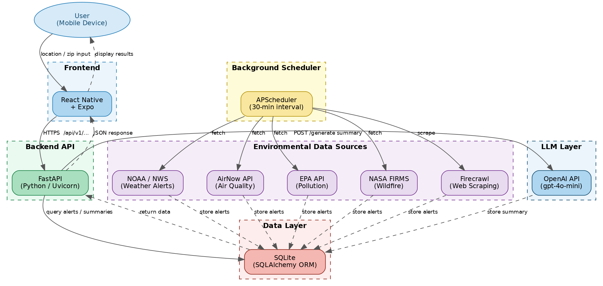

# RiskRadar – Tech Stack Reference
**Source:** Security Questionnaires (Feb–Mar 2026) — Noah Benoit, Max Compeaux, Rebecca Gautreaux, Celeste George, Qui Huynh, Ben Manuel | Main branch source code

---

## Tech Stack Flowchart

The diagram below maps the full request/response flow across all layers of the stack. Solid arrows = request path; dashed arrows = response/write path.

**Reading the diagram:** A user enters their location or zip code in the **React Native + Expo** mobile app, which sends HTTPS requests to the **FastAPI** backend (served by Uvicorn). The API queries **SQLite** (via SQLAlchemy ORM) for stored alerts and summaries, and calls the **OpenAI API** (gpt-4o-mini) to generate plain-language risk summaries on demand. In the background, **APScheduler** runs every 30 minutes, triggering scrapers for **NOAA/NWS** (weather alerts), **AirNow** (air quality), **EPA** (pollution), **NASA FIRMS** (wildfire), and **Firecrawl** (web scraping); all scrapers write results back to SQLite. All backend components run on **AWS EC2** within a private VPC.

---

## Consensus

### Platform
- **Cross-platform mobile app**
- **Android is the primary target**; iOS acknowledged as harder to implement (Ben Manuel, Qui Huynh)
- `device_token` field in the `users` model with a `platform` field in `device_tokens` confirms multi-platform device support is planned

---

### Frontend Framework
| Response | Submitted By |
|---|---|
| React Native via Expo | Ben Manuel, Qui Huynh |
| React (general) | Max Compeaux |

**Takeaway:** React Native + Expo is the working frontend choice, per Ben Manuel (front-end lead). Max Compeaux's "React (general)" likely refers to the same stack without specifying Expo — **please confirm** whether Max intended React Native + Expo or a web-based React app.

---

### Backend Framework
| Source | Technology |
|---|---|
| Questionnaires | Node.js (Ben Manuel); RabbitMQ (Max Compeaux, Qui Huynh) |
| **Source code (main branch)** | **FastAPI (Python), served by Uvicorn** |

> **[!] Updated from source code:** The working backend is FastAPI, not Node.js. RabbitMQ is not present in the codebase — background task scheduling is handled by **APScheduler** (`apscheduler>=3.10.4`), which triggers scrapers on a configurable interval (default 30 minutes). Node.js and RabbitMQ should be considered superseded.

---

### Database
| Source | Technology |
|---|---|
| Questionnaires | SQLite (Max Compeaux, Qui Huynh); N/A (Ben Manuel) |
| Rebecca's SQL draft | MariaDB / MySQL (InnoDB) |
| **Source code (main branch)** | **SQLite via SQLAlchemy ORM** (`sqlite:///riskradar.db`) |

> **[!] Clarified from source code:** The working codebase uses SQLite via SQLAlchemy, confirming the questionnaire responses. Rebecca's MariaDB schema was a planning/draft artifact and is not reflected in the current implementation. SQLAlchemy's ORM means migrating to PostgreSQL or MariaDB later remains straightforward.

---

### Data Sources & APIs
| Tool | Role | Source |
|---|---|---|
| NOAA / NWS API | Weather alerts — no API key required | `nws_scraper.py` |
| AirNow API | Air quality observations — free API key required | `airnow_scraper.py` |
| EPA API | Pollution data — no API key required | `epa_scraper.py` |
| NASA FIRMS API | Wildfire / active fire data — API key required | `firms_scraper.py` |
| Firecrawl | Supplementary web scraping — API key required | `requirements.txt` |
| OpenAI API | LLM summaries (gpt-4o-mini, configurable) | `summarizer.py`, `settings.py` |

> **[!] Updated from source code:** The questionnaires named only OpenAI and Firecrawl. The actual codebase integrates four dedicated environmental data APIs (NWS, AirNow, EPA, NASA FIRMS) as the primary data pipeline. Firecrawl is present as a dependency for supplementary web scraping. The LLM model is **gpt-4o-mini** by default (not gpt-4o), and the summarizer also supports Anthropic as an alternative provider via a config switch.

---

### Hosting
| Response | Submitted By |
|---|---|
| AWS | Max Compeaux, Qui Huynh |
| N/A | Ben Manuel |

**Takeaway:** AWS is the agreed hosting platform.

---

## API Endpoints (from source code)

All routes are prefixed `/api/v1`.

| Endpoint | Method | Description |
|---|---|---|
| `/alerts` | GET | List alerts; filterable by type, severity, source |
| `/alerts/stats` | GET | Count of alerts by type and severity |
| `/alerts/{id}` | GET | Single alert detail |
| `/summaries` | GET | List AI-generated summaries |
| `/summaries/latest` | GET | Most recent summary |
| `/summaries/generate` | POST | Trigger on-demand LLM digest |
| `/users/register` | POST | Create user account |
| `/users/{id}/preferences` | PUT | Update alert prefs, zip, device token |
| `/` | GET | Health check |

---

## Authentication

> **[!] Updated from source code:** All questionnaires stated no user login is required. The working codebase includes `POST /api/v1/users/register` with email, display name, zip code, and password. Passwords are hashed with **SHA-256** (`hashlib`). **Please confirm** at the meeting whether user accounts are required for the final product or if the registration endpoint is provisional.

---

## Data Collected

The `User` model in `models.py` stores: display name, email, password hash, zip code, latitude, longitude, alert type preferences (JSON array), notify severity, and device token. The `Alert` model stores: source, alert type, severity, title, description, raw JSON, coordinates, location name, and timestamps. The `Summary` model stores: LLM-generated content, model used, token count, and linked alert IDs.

---

## Security Notes
- API key management: AIRNOW, NASA FIRMS, Firecrawl, and LLM keys are loaded from a `.env` file via `pydantic-settings` — **confirm `.env` is excluded from version control**
- Password hashing: SHA-256 via `hashlib` — consider upgrading to bcrypt or Argon2 before production. SHA-256 is a general-purpose cryptographic hash designed to be fast, which is the wrong property for password storage — a modern GPU can compute billions of SHA-256 hashes per second, making brute-force attacks trivial. The current implementation also appears to hash passwords without a salt, meaning two users with the same password produce identical hashes. bcrypt and Argon2 are purpose-built password hashing functions with a configurable cost factor (making each hash intentionally slow), automatic per-password salting, and in Argon2's case, memory-hardness that defeats GPU/ASIC parallelization. The fix is a one-line change in `users.py` and would meaningfully raise the bar against a credential leak.
- CORS is currently set to `allow_origins=["*"]` in `main.py` — **needs to be restricted before deployment**. CORS (Cross-Origin Resource Sharing) controls which domains a browser will allow to make requests to the API. A wildcard `"*"` permits any website on the internet to send requests to the backend from a user's browser, which opens the door to cross-site request forgery and makes it trivial for third parties to build unauthorized clients against the API. Before deployment, `allow_origins` should be locked to the specific origin(s) the React Native app and any web interface will be served from. This is a one-line change in `main.py` and should be treated as a hard requirement before the app goes live.
- No rate limiting implemented yet on any endpoint. Without rate limiting, a single client can flood the API with requests, driving up OpenAI API costs (each `/summaries/generate` call consumes tokens), exhausting database connections, or triggering denial-of-service conditions. At minimum, the `/summaries/generate` and `/users/register` endpoints should be rate-limited — the former because it directly incurs LLM billing cost, and the latter because an open registration endpoint is a common target for account enumeration and credential-stuffing attacks. FastAPI integrates cleanly with `slowapi` (a Starlette-compatible rate limiting library) with minimal code changes.
- Input validation: handled by Pydantic schemas on all API routes

---

## Gaps / TBDs Identified
- CORS origins need to be locked down before deployment
- Password hashing algorithm should be upgraded from SHA-256 to bcrypt or Argon2
- API key storage strategy for production — `.env` file is development-only
- Rate limiting on API endpoints — TBD
- Role-based access control — not present in current schema or endpoints
- Authentication mechanism beyond registration — no login/session/JWT endpoint exists yet
