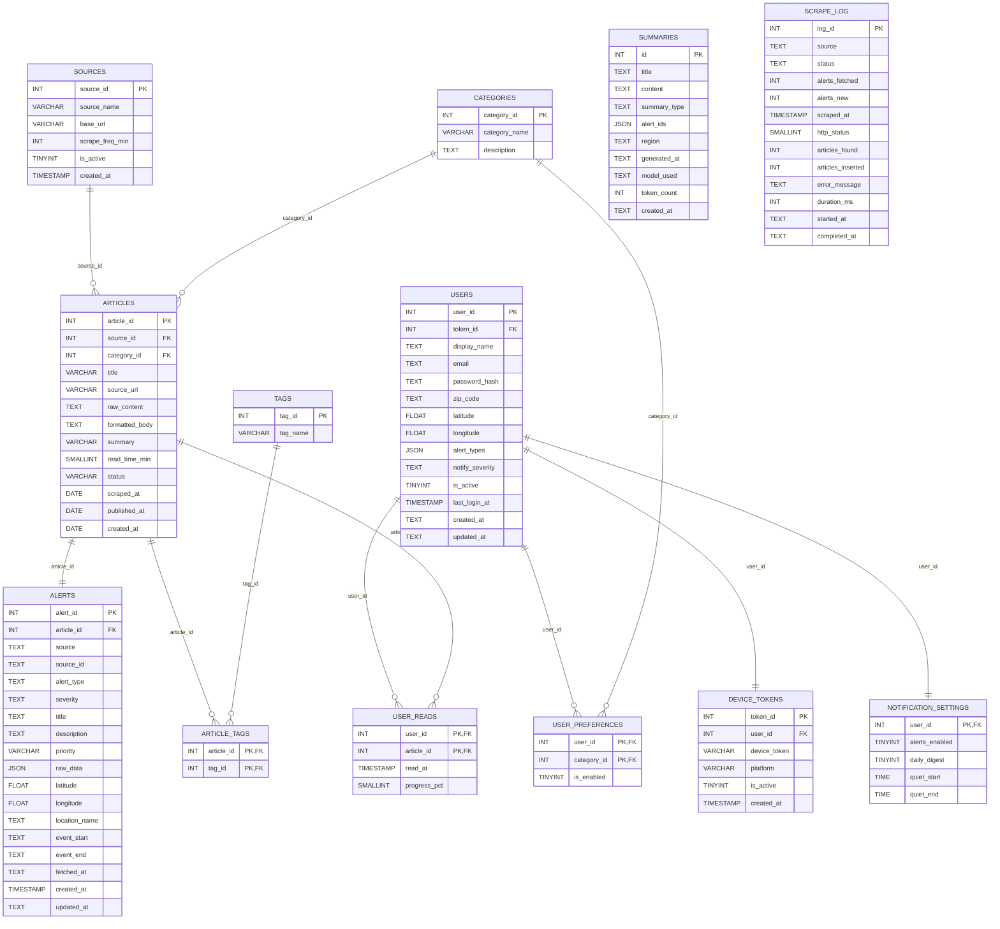

# RiskRadar Data Model
---

## Overview

RiskRadar uses a **MariaDB 10.4** relational database (`riskradar_db`) managed via **SQLAlchemy ORM**, consisting of **13 tables** organized into four functional groups: **Content**, **Users**, **Alerts & AI**, and **Operations**.

> **Closure status (Apr 12, 2026):** Local database closure sequence is fully verified (`preflight=ok`, `schema_drift=ok`, strict contract `safety_gate=ok`, backend tests `185 passed, 3 skipped`). Staging/production closure remains **pending environment access** and must be executed by team members with staging/prod DB credentials and deployment permissions.

---

## Entity-Relationship Overview

```
users ──────────┬──< user_preferences >──── categories
                │
                ├──< user_reads >────────── articles
                │                              │
                ├──< device_tokens             ├──< article_tags >──── tags
                │                              │
                └──── notification_settings    ├───── sources
                                               │
                                             alerts
                                               │
                                            summaries

                      scrape_log (standalone)
```

---

## Content Tables

### `articles`

Stores scraped articles from external sources.

| Column | Type | Description |
|---|---|---|
| `article_id` | `INT` PK | Unique article identifier |
| `source_id` | `INT` FK | References `sources.source_id` |
| `category_id` | `INT` FK | References `categories.category_id` |
| `title` | `VARCHAR(500)` | Article headline |
| `source_url` | `VARCHAR(1000)` | Original URL |
| `raw_content` | `TEXT` | Unprocessed scraped content |
| `formatted_body` | `TEXT` | Cleaned/formatted content |
| `summary` | `VARCHAR(1000)` | Brief summary text |
| `read_time_min` | `SMALLINT` | Estimated reading time in minutes |
| `status` | `VARCHAR(20)` | Processing status |
| `scraped_at` | `DATE` | When the article was scraped |
| `published_at` | `DATE` | Original publication date |
| `created_at` | `DATE` | Record creation date |

**Unique constraint**: (`source_id`, `category_id`)

### `sources`

Defines external data sources that RiskRadar scrapes.

| Column | Type | Description |
|---|---|---|
| `source_id` | `INT` PK | Unique source identifier |
| `source_name` | `VARCHAR(100)` | Human-readable name |
| `base_url` | `VARCHAR(500)` | Root URL for scraping |
| `scrape_freq_min` | `INT` | Scrape interval in minutes |
| `is_active` | `TINYINT(1)` | Whether the source is actively scraped |
| `created_at` | `TIMESTAMP` | Record creation timestamp |

### `categories`

Classifies articles into topic categories.

| Column | Type | Description |
|---|---|---|
| `category_id` | `INT` PK | Unique category identifier |
| `category_name` | `VARCHAR(50)` | Category label |
| `description` | `TEXT` | Category description |

### `tags`

Freeform labels applied to articles.

| Column | Type | Description |
|---|---|---|
| `tag_id` | `INT` PK | Unique tag identifier |
| `tag_name` | `VARCHAR(50)` | Tag label |

### `article_tags`

Junction table linking articles to tags (many-to-many).

| Column | Type | Description |
|---|---|---|
| `article_id` | `INT` PK, FK | References `articles.article_id` |
| `tag_id` | `INT` PK, FK | References `tags.tag_id` |

---

## User Tables

### `users`

Stores registered user accounts and preferences.

| Column | Type | Description |
|---|---|---|
| `user_id` | `INT` PK | Unique user identifier |
| `token_id` | `INT` FK | References `device_tokens.token_id` |
| `display_name` | `TEXT` | User's display name |
| `email` | `TEXT` | Email address (unique) |
| `password_hash` | `TEXT` | Hashed password |
| `zip_code` | `TEXT` | User's zip code |
| `latitude` | `FLOAT` | Geographic latitude |
| `longitude` | `FLOAT` | Geographic longitude |
| `alert_types` | `JSON` | Array of alert type preferences |
| `notify_severity` | `TEXT` | Minimum severity for notifications |
| `is_active` | `TINYINT(1)` | Whether the account is active |
| `last_login_at` | `TIMESTAMP` | Most recent login |
| `created_at` | `TEXT` | Account creation time |
| `updated_at` | `TEXT` | Last profile update time |

**Unique constraints**: `token_id`, `email`

### `device_tokens`

Tracks push notification tokens for user devices.

| Column | Type | Description |
|---|---|---|
| `token_id` | `INT` PK | Unique token identifier |
| `user_id` | `INT` FK | References `users.user_id` |
| `device_token` | `VARCHAR(255)` | Push notification token |
| `platform` | `VARCHAR(10)` | Device platform (e.g., iOS, Android) |
| `is_active` | `TINYINT(1)` | Whether the token is active |
| `created_at` | `TIMESTAMP` | Token registration time |

**Unique constraint**: `user_id`

### `notification_settings`

Per-user notification configuration.

| Column | Type | Description |
|---|---|---|
| `user_id` | `INT` PK, FK | References `users.user_id` |
| `alerts_enabled` | `TINYINT(1)` | Master notification toggle |
| `daily_digest` | `TINYINT(1)` | Whether to receive daily digest emails |
| `quiet_start` | `TIME` | Start of quiet hours |
| `quiet_end` | `TIME` | End of quiet hours |

### `user_preferences`

Junction table linking users to their preferred categories.

> **Status**: Legacy typo (`user_prefernces`) is remediated by migration `2026-04-12_phase1_typo_schema_fixes.sql`.

| Column | Type | Description |
|---|---|---|
| `user_id` | `INT` PK, FK | References `users.user_id` |
| `category_id` | `INT` PK, FK | References `categories.category_id` |
| `is_enabled` | `TINYINT(1)` | Whether the preference is active |

### `user_reads`

Tracks which articles a user has read and their progress.

> **Status**: Legacy typo (`articlle_id`) is remediated by migration `2026-04-12_phase1_typo_schema_fixes.sql`.

| Column | Type | Description |
|---|---|---|
| `user_id` | `INT` PK, FK | References `users.user_id` |
| `article_id` | `INT` PK, FK | References `articles.article_id` |
| `read_at` | `TIMESTAMP` | When the user read the article |
| `progress_pct` | `SMALLINT` | Reading progress percentage (0–100) |

---

## Alerts & AI Tables

### `alerts`

Stores risk alerts generated from or linked to articles.

| Column | Type | Description |
|---|---|---|
| `alert_id` | `INT` PK | Unique alert identifier |
| `article_id` | `INT` FK | References `articles.article_id` (unique) |
| `source` | `TEXT` | Alert source identifier |
| `source_id` | `TEXT` | External source's ID for this alert |
| `alert_type` | `TEXT` | Type of alert (e.g., weather, air_quality) |
| `severity` | `TEXT` | Severity level |
| `title` | `TEXT` | Alert headline |
| `description` | `TEXT` | Alert details |
| `priority` | `VARCHAR(10)` | Priority ranking |
| `raw_data` | `JSON` | Raw alert payload from the source (validated via `json_valid()`) |
| `latitude` | `FLOAT` | Event latitude |
| `longitude` | `FLOAT` | Event longitude |
| `location_name` | `TEXT` | Human-readable location |
| `event_start` | `TEXT` | Event start time |
| `event_end` | `TEXT` | Event end time |
| `fetched_at` | `TEXT` | When the alert was fetched |
| `created_at` | `TIMESTAMP` | Record creation timestamp |
| `updated_at` | `TEXT` | Last update time |

**Unique constraints**: `article_id`, (`source`, `source_id`)

### `summaries`

Stores AI-generated summaries that aggregate multiple alerts.

| Column | Type | Description |
|---|---|---|
| `id` | `INT` PK | Unique summary identifier |
| `title` | `TEXT` | Summary title |
| `content` | `TEXT` | Generated summary text |
| `summary_type` | `TEXT` | Type of summary |
| `alert_ids` | `JSON` | Array of alert IDs included (validated via `json_valid()`) |
| `region` | `TEXT` | Geographic region covered |
| `generated_at` | `TEXT` | When the summary was generated |
| `model_used` | `TEXT` | AI model identifier (e.g., `gpt-4o-mini`) |
| `token_count` | `INT` | Number of tokens used for generation |
| `created_at` | `TEXT` | Record creation time |

> **Status**: Previously fixed by migration `2026-03-03_mariadb_scraper_alignment.sql`.

**Unique constraint**: `alert_ids`

---

## Operations Tables

### `scrape_log`

Audit log for each scraping run.

| Column | Type | Description |
|---|---|---|
| `log_id` | `INT` PK | Unique log entry identifier |
| `source` | `TEXT` | Source that was scraped (unique) |
| `status` | `TEXT` | Scrape result status |
| `alerts_fetched` | `INT` | Number of alerts retrieved |
| `alerts_new` | `INT` | Number of new alerts inserted |
| `scraped_at` | `TIMESTAMP` | Scrape timestamp |
| `http_status` | `SMALLINT` | HTTP response code |
| `articles_found` | `INT` | Number of articles discovered |
| `articles_inserted` | `INT` | Number of new articles inserted |
| `error_message` | `TEXT` | Error details (if any) |
| `duration_ms` | `INT` | Scrape duration in milliseconds |
| `started_at` | `TEXT` | Scrape start time |
| `completed_at` | `TEXT` | Scrape completion time |

**Unique constraint**: `source`

---

## Key Relationships

| Parent Table | Child Table | Relationship | Join Column(s) |
|---|---|---|---|
| `sources` | `articles` | One-to-many | `source_id` |
| `categories` | `articles` | One-to-many | `category_id` |
| `articles` | `article_tags` | Many-to-many (via junction) | `article_id` |
| `tags` | `article_tags` | Many-to-many (via junction) | `tag_id` |
| `articles` | `alerts` | One-to-one | `article_id` |
| `users` | `device_tokens` | One-to-one | `user_id` |
| `users` | `notification_settings` | One-to-one | `user_id` |
| `users` | `user_preferences` | Many-to-many (via junction) | `user_id` |
| `categories` | `user_preferences` | Many-to-many (via junction) | `category_id` |
| `users` | `user_reads` | Many-to-many (via junction) | `user_id` |
| `articles` | `user_reads` | Many-to-many (via junction) | `article_id` |

## Database Schema



> Note: `SUMMARIES.alert_ids` stores alert linkage as JSON rather than a normalized junction table, so no direct FK edge is present.

---

## Normalization Analysis

> **Current status (2026-04-12):** Normalization remediation is implemented and locally verified. Remaining project-wide closure work is operational rollout in staging/production and optional contract retirement of legacy compatibility columns after environment-level safety-gate approval.

### Verified Closure State (Local)

- `python backend/db/migrations/preflight.py` -> `status=ok`
- `python backend/db/migrations/schema_drift_check.py` -> `status=ok`
- `MIGRATION_PREFLIGHT_STRICT=true MIGRATION_NORMALIZATION_CONTRACT_REQUIRED=true python backend/db/migrations/safety_gate.py` -> `status=ok`
- `python -m pytest -q backend/tests` -> `185 passed, 3 skipped`

### Staging/Production Closure State

- Not executed from this workspace session because no staging/prod database access credentials were present in the environment.
- Required next action: run the exact verified closure sequence in staging and production with deployment-access owners, then attach pass/fail evidence to `backend/db/migrations/MIGRATION_NOTES.md` and `docs/GROUP_PROGRESS_LOG`.

### Remaining Open Items

- Staging/production closure execution is pending required DB/deployment access in those environments.
- Contract retirement migration (`2026-04-12_phase5_contract_retire_legacy_columns.sql`) is pending final environment-level safety-gate approval.

---

## Resolved Database Issues

The following schema and normalization issues are resolved in the codebase/local verified closure path:

| Table | Column/Name | Issue |
|---|---|---|
| `user_prefernces` | (table name) | Remediated by `2026-04-12_phase1_typo_schema_fixes.sql` |
| `user_reads` | `articlle_id` | Remediated by `2026-04-12_phase1_typo_schema_fixes.sql` |
| `summaries` | `reigon` | Remediated by `2026-03-03_mariadb_scraper_alignment.sql` |
| `summaries` | `alert_ids` JSON linkage | Relational replacement implemented via `summary_alerts` + backfill/parity tooling (Phase 2) |
| `users` | `alert_types` JSON linkage | Relational replacement implemented via `user_alert_type_preferences` + backfill/parity tooling (Phase 3) |
| `users` | `zip_code -> latitude/longitude` transitive dependency | Lookup remediation implemented via `zip_geo` with override-compatible runtime behavior (Phase 4) |
| `alerts` | `latitude/longitude -> location_name` transitive dependency | Canonical location mapping implemented via `locations` + `alerts.location_id` (Phase 4) |
| `alerts` | `raw_data` JSON payload in base row | Canonical payload extraction implemented via `alert_raw_payloads` (Phase 4) |